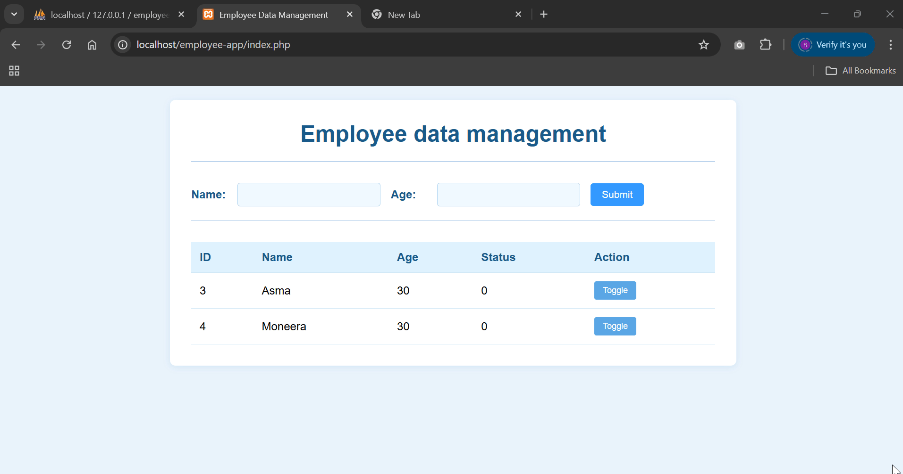

# Employee Data Management System

A simple web-based application for managing employee data, built using **HTML**, **CSS**, **PHP**, and **MySQL**, and hosted locally using **XAMPP**.

---

##  Project Overview

This system allows users to:
- Add new employees (name and age)
- View employee data in a styled table
- Toggle employee status (active/inactive)

---

##  Tools & Technologies Used

- **Frontend**: HTML, CSS  
- **Backend**: PHP  
- **Database**: MySQL  
- **Local Server**: XAMPP (Apache + MySQL)

---

##  How to Run the Project (with XAMPP)

> This project runs locally using the XAMPP environment.

### 1. Install XAMPP
- Download from: [https://www.apachefriends.org](https://www.apachefriends.org)
- Install it and open the **XAMPP Control Panel**

### 2. Start Apache & MySQL
- In the control panel, start:
  - **Apache**
  - **MySQL**

### 3. Create the Database
- Go to: `http://localhost/phpmyadmin`
- Create a new database named: `employees`
- Inside the database, create a table with the following structure:

| Column | Type     | Attributes                  |
|--------|----------|-----------------------------|
| id     | INT      | PRIMARY KEY, AUTO_INCREMENT |
| name   | VARCHAR  | Length: 255                 |
| age    | INT      |                             |
| status | TINYINT  | Default: 0                  |

---

### 4. Add Project Files

Copy the following files into your `htdocs` directory:

```
C:
└── xampp
    └── htdocs
        └── employee-app
            ├── index.php
            ├── insert.php
            ├── toggle.php
            └── style.css
```


### 5. Run the Web App

- Open your browser and navigate to:  
  `http://localhost/employee-app/`

---

##  Demo


نسخ
تحرير

